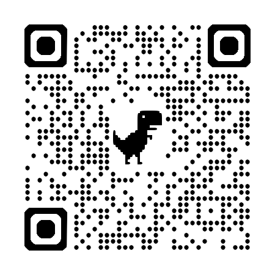
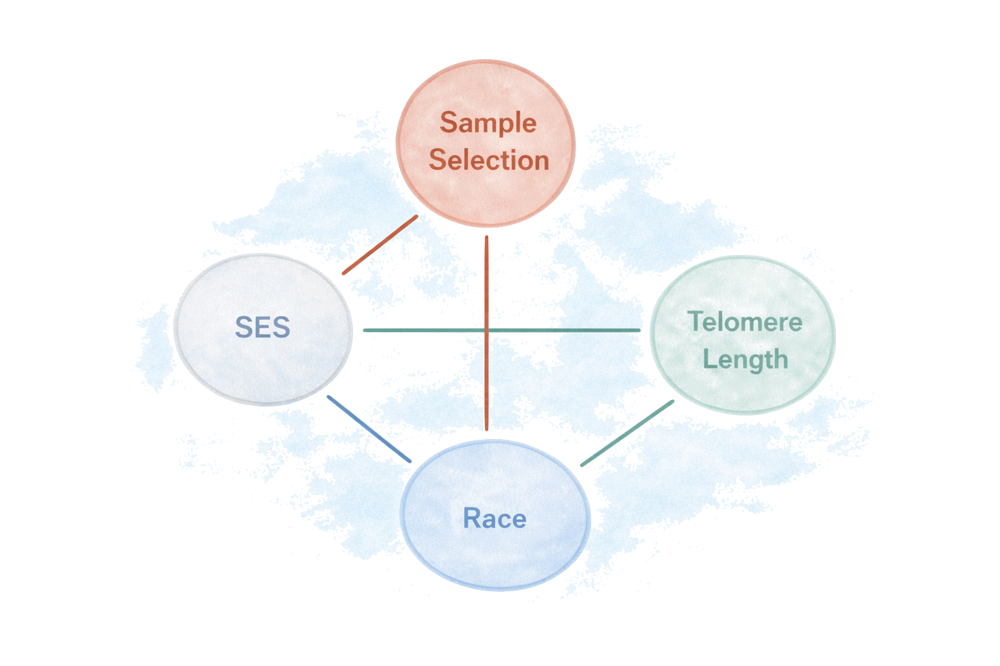
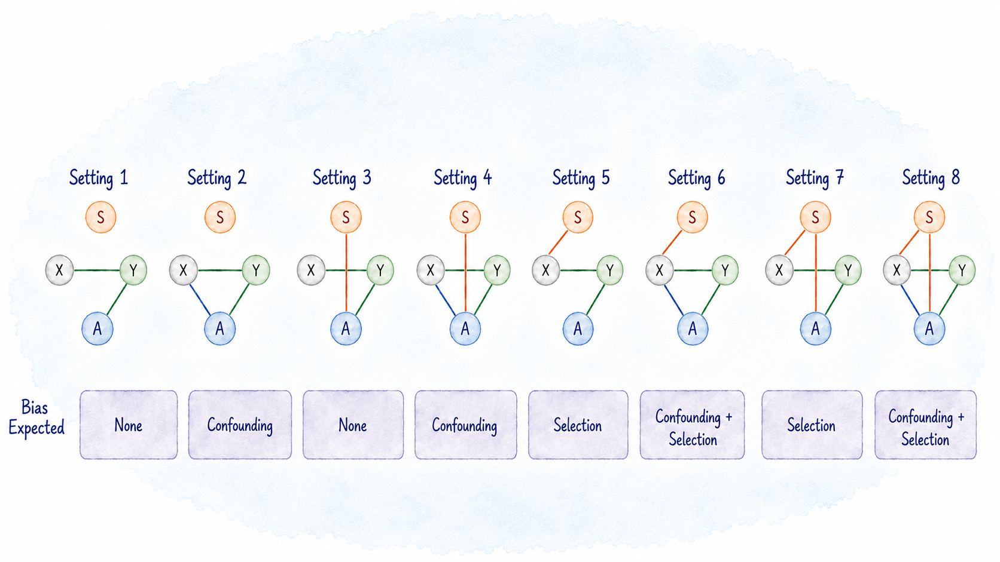
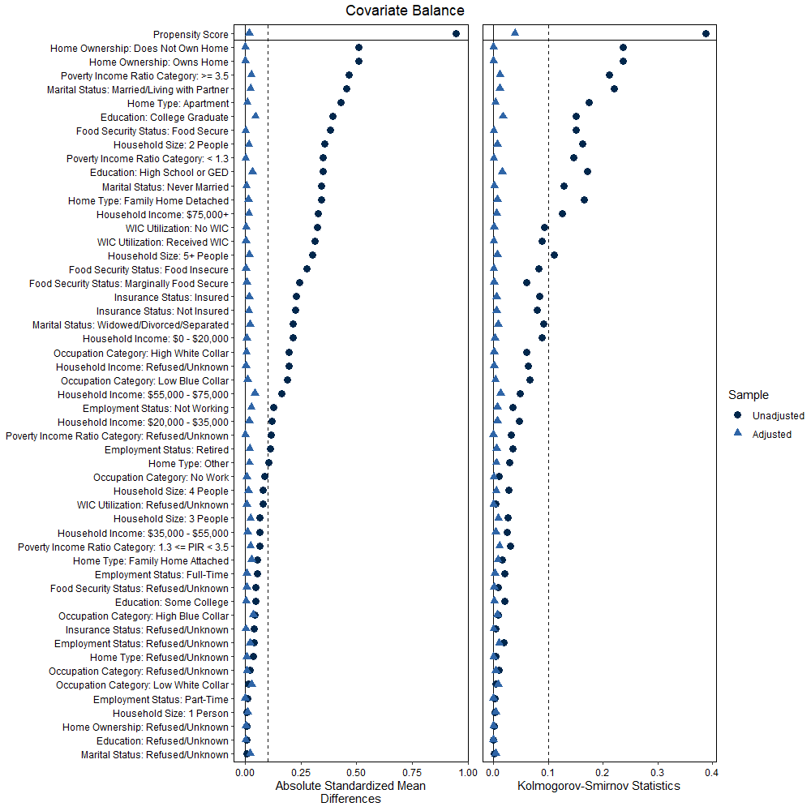
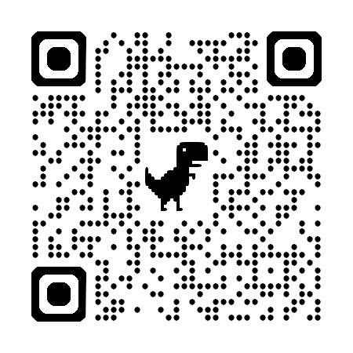
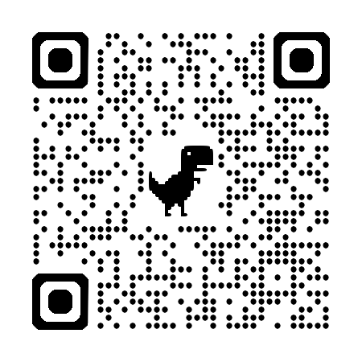
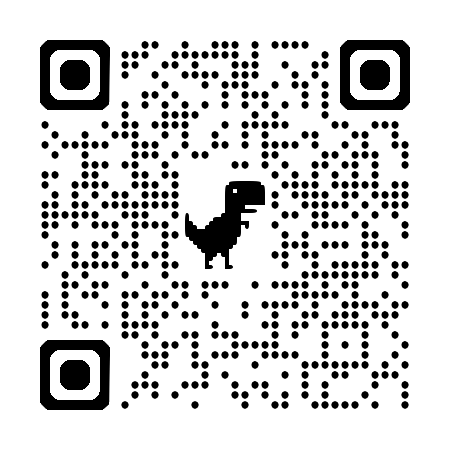

## QR Code for These Slides

{.r-stretch fig-align="center"}

## Our Group {.center}

::: {.collab-grid}
::: {.collab}

**Emily K. Roberts**  
University of Iowa
:::

::: {.collab}

**Belinda L. Needham**  
University of Michigan
:::

::: {.collab}

**Tyler H. McCormick**  
University of Washington
:::

::: {.collab}

**Fan Li**  
Yale University
:::

::: {.collab}

**Bhramar Mukherjee**  
Yale University
:::

::: {.collab}

**Xu Shi**  
University of Michigan
:::
:::

# Background

## What are Telomeres?

### Regions of DNA on chromosomes that protect genomic stability {.fragment}

![[Like the protective "caps" on the ends of shoelaces]{.caption}](images/shoelace_bg.png){.fragment .centered-figure-img width="70%" fig-align="center"}

## Telomeres Shorten As Cells Divide

### Shorter length associated with cardiometabolic outcomes {.fragment}

![[Affected by age, sex, race/ethnicity, genetics, SES, environment, psychosocial stress, ...]{.caption}](images/telomeres2_bg.png){.fragment .centered-figure-img width="70%" fig-align="center"}

## Relationship with Race and SES

### Longer telomeres in Black individuals has been described as a paradox {.fragment}

![[But comparable length has been observed in populations with similar SES]{.caption}](images/compare_bg.png){.fragment .centered-figure-img width="70%" fig-align="center"}

# Motivation

## Which is a Meaningful Health Policy Question?

<br>

:::: {.columns}
::: {.column width="45%"}
### Descriptive Comparison {.fragment}

[How different is mean telomere length between Black and White adults in the United States?]{.fragment}
:::

:::: {.column width="8%"}
[vs.]{.fragment text-align="left"}
::::

::: {.column width="47%"}
### Controlled Comparison {.fragment}

[With balanced socioeconomic factors and a nationally representative sample, would the difference remain?]{.fragment}
:::
::::

<br>

[**Note:** This is not a causal effect as race is not 'manipulable.' This is a controlled comparison after balancing socioeconomic conditions.]{.fragment}

## Motivating Question {.center}

<br>

### If we could hypothetically [*balance*]{style="color: #003865;"} SES between Black and White individuals in a [*nationally representative sample*]{style="color: #003865;"}, would we still see significant [*Black/White differences*]{style="color: #003865;"} in telomere length? {.fragment text-align="center"}

## What is Our Nationally Representative Sample?

### National Health and Nutrition Examination Survey {.fragment}

<br>

![[Rich data from interviews, physical examinations, laboratory tests, ...]{.caption}](images/nhanes_bg.png){.fragment .centered-figure-img width="70%" fig-align="center"}

## NHANES Stratified, Clustered Sampling Design

### Primary sampling units (counties) and demographic-specific strata {.fragment}

<br>

![[Oversamples non-Hispanic Black participants and participants below 130% of the federal poverty limit]{.caption}](images/sampling_bg.png){.fragment .centered-figure-img width="60%" fig-align="center"}

## Why does This Make Our Question Challenging?

### Two potential sources of bias {.fragment}

1. **Confounding:** Race is associated with both SES and telomere length, and SES is associated with telomere length
2. **Selection:** NHANES intentionally oversamples based (in part) on race and SES

![[Conceptual Diagram]{.caption}](images/dag_bg.png){.fragment width="50%" fig-align="center"}

## Notation

### Survey of $n$ participants from a population of $N$ individuals {.fragment}

:::: {.columns}
::: {.column width="50%"}

- $\class{highlight-prop}{\ A\ }$: Race ($1=$ Black, $0=$ White)
- $\class{highlight-gray}{\ \boldsymbol{X}\ }$: Covariates (SES)
- $\class{highlight-green}{\ Y\ }$: Outcome (log Telomere Length)
- $\class{highlight-selection}{\ S\ }$: Sample Selection Indicator
- $P$: Population distribution of $(\class{highlight-prop}{A},\ \class{highlight-gray}{\boldsymbol{X}},\ \class{highlight-green}{Y})$
- $Q$: Sample distribution given $\class{highlight-selection}{S = 1}$

:::

::: {.column width="50%"}
{.fragment .centered-figure-img width="100%" fig-align="center"}
:::
::::

[If selection depends on both $\class{highlight-prop}{\ A\ }$ and $\class{highlight-gray}{\ \boldsymbol{X}\ }$, the final estimand requires a coherent factorization of the ***selection*** and ***group membership*** probabilities]{.fragment}

## What is Being Balanced/Weighted?

<br>

:::: {.columns}
::: {.column width="50%"}
### Within-Sample Covariate Balance {.fragment}

[Use a propensity score for group membership:]{.fragment}

[$$\class{highlight-prop}{e_a(\boldsymbol{X})} = \Pr(\class{highlight-prop}{A = a} \mid\ \class{highlight-gray}{\boldsymbol{X}})$$]{.fragment}

[**Purpose:** Make covariate distributions comparable between groups.]{.fragment}
:::

::: {.column width="50%"}
### Population Generalizability {.fragment}

[Use the selection mechanism (e.g., survey weights):]{.fragment}

[$$\class{highlight-selection}{\pi(A, \boldsymbol{X})} = \Pr(\class{highlight-selection}{S=1} \mid\ \class{highlight-prop}{A},\ \class{highlight-gray}{\boldsymbol{X}})$$]{.fragment}

[**Purpose:** Weight the sample to the target population.]{.fragment}
:::
::::

## Questions:

<br>

- How do we incorporate these propensity and/or survey weights?
- Do we survey weight the propensity model? 

## Answer: 

### It depends on the *design* and how we factorize this *joint probability* {.fragment}

[$$\Pr(\class{highlight-selection}{S=1},\ \class{highlight-prop}{A=a} \mid\ \class{highlight-gray}{\boldsymbol{X}})$$]{.fragment}

<br>

:::: {.columns}
::: {.fragment .column width="50%"}
### Factorization 1

$$\Pr(\class{highlight-prop}{A=a} \mid\ \class{highlight-gray}{\boldsymbol{X}}) \times \Pr(\class{highlight-selection}{S=1} \mid\ \class{highlight-prop}{A=a},\ \class{highlight-gray}{\boldsymbol{X}})$$
$$=\ \class{highlight-prop}{e_a^{P}(\boldsymbol{X})} \times\ \class{highlight-selection}{\pi(A, \boldsymbol{X})}$$

Population (Survey-Weighted) Propensity Score $\times$ Group-Specific Selection Probability
:::

::: {.fragment .column width="50%"}
### Factorization 2

$$\Pr(\class{highlight-prop}{A=a} \mid\ \class{highlight-gray}{\boldsymbol{X}},\ \class{highlight-selection}{S=1}) \times \Pr(\class{highlight-selection}{S=1} \mid\ \class{highlight-gray}{\boldsymbol{X}})$$

$$=\ \class{highlight-prop}{e_a^{Q}(\boldsymbol{X})} \times\ \class{highlight-selection}{\pi(\boldsymbol{X})}$$

Within-Sample Propensity Score $\times$ Marginalized Selection Probability
:::
::::

# Estimation

## Target of Inference

### The ***average controlled difference (ACD)*** in telomere length {.fragment}

<br>

::: {.fragment}
For group level $a \in \{0,1\}$:

$$\mu(a) = \mathbb{E}_{P}\left[\mathbb{E}(\class{highlight-green}{Y} \mid\ \class{highlight-prop}{A = a},\ \class{highlight-gray}{\boldsymbol{X}})\right]$$
:::

::: {.fragment}
The population-standardized, covariate-balanced difference in mean telomere length between Black and White individuals

$$\text{ACD} = \mu(1) - \mu(0)$$
:::

## Four Proposed Estimators

::: {.fragment}
### Inverse Probability Weighting with Factorization 1

Use a population propensity and group-specific selection weight

$$\hat{\mu}_{IPW1}(a) = \frac{1}{n}\sum_{i=1}^n \frac{\class{highlight-prop}{I(A_i=a)}}{\class{highlight-prop}{\hat{e}_a^P(\boldsymbol{X}_i)}} \times\ \class{highlight-green}{Y_i} \times \frac{\class{highlight-selection}{\Pr(S = 1)}}{\class{highlight-selection}{\pi(A_i, \boldsymbol{X}_i)}}$$
:::

<br>

::: {.fragment}
### Inverse Probability Weighting with Factorization 2

Use a within-sample propensity and marginalized selection weight

$$\hat{\mu}_{IPW2}(a) = \frac{1}{n}\sum_{i=1}^n \frac{\class{highlight-prop}{I(A_i=a)}}{\class{highlight-prop}{\hat{e}_a^Q(\boldsymbol{X}_i)}} \times\ \class{highlight-green}{Y_i} \times \frac{\class{highlight-selection}{\Pr(S = 1)}}{\class{highlight-selection}{\pi(\boldsymbol{X}_i)}}$$
:::

## Four Proposed Estimators

::: {.fragment}
### Outcome Modeling (G-Formula)

Directly model $\mathbb{E}(Y \mid A, \boldsymbol{X}, S=1)$, then standardize to the population

$$\hat\mu_{OM}(a) = \frac{1}{n}\sum_{i=1}^n \class{highlight-green}{\hat{g}_a(\boldsymbol{X}_i)}\times \frac{\class{highlight-selection}{\Pr(S = 1)}}{\class{highlight-selection}{\pi(\boldsymbol{X}_i)}}$$
:::

::: {.fragment}
### AIPW / Doubly Robust

Combine outcome modeling with inverse probability weighting

$$\hat{\mu}_{AIPW}(a) = \frac{1}{n}\sum_i \frac{\class{highlight-selection}{\Pr(S = 1)}}{\class{highlight-selection}{\pi(\boldsymbol{X}_i)}}\times \left[\frac{\class{highlight-prop}{I(A_i=a)}}{\class{highlight-prop}{\hat{e}_a^Q(\boldsymbol{X}_i)}} \class{highlight-green}{\{Y_i - \hat g_a(X_i)\}+\hat{g}_a(X_i)}\right]$$
:::

# Simulations

## How do Existing Methods Compare?

| Method | Addressing Confounding? | Addressing Selection? |
|------------------|:-----------------:|:-----------------:|
**Existing Approaches**                             |          |     |
Simple Regression                                   | No       | No  |
Multiple Regression                                 | Partial  | No  |
IPTW Estimator                                      | Yes      | No  |
Survey-Weighted Multiple Regression                 | Partial  | Yes |
IPTW Multiple Regression                            | Yes      | No  |
IPTW + Survey-Weighted Multiple Regression          | Yes      | Yes |
Weighted IPTW + Survey-Weighted Multiple Regression | Yes      | Yes |
**Proposed Approaches**                             |          |     |
Outcome Modeling and Direct Standardization         | Yes      | Yes |
Inverse Probability Weighting 1                     | Yes      | Yes |
Inverse Probability Weighting 2                     | Yes      | Yes |
Augmented Inverse Probability Weighting             | Yes      | Yes |

[Among existing methods that address both, there is still a possibility for bias if the weights are incorrectly specified]{.fragment}

## Simulation Results

{width="50%" fig-align="center"}

- **Settings 1 + 3:** All methods perform comparably for bias, MSE, and coverage
- **Settings 2 + 4:** Methods that appropriately adjust for $A$ and $\boldsymbol{X}$ perform well
- **Settings 5 + 7:** Not survey weighting results in bias and poor coverage
- **Settings 6 + 8:** Proposed estimators outperform current approaches

## Simulation Takeaways

<br>

- Methods that address only confounding or only selection can be biased
- Methods that ignore the clustered survey design can understate uncertainty
- Proposed approaches best align the target, weights, and variance calculation

# Race, SES, and Telomere Length

## NHANES Analysis

:::: {.columns}
::: {.column width="50%"}
### Data

- NHANES 1999–2002
- Non-Hispanic Black and White Participants
- Analytic Sample: $n=5{,}270$
- Outcome: log Telomere Length Ratio
:::

::: {.column width="50%"}
### Adjustment Set

- Age, Sex, Blood Composition

- 12 Socioeconomic Indicators: PIR, Education, Income, Home Ownership, Food Security, Insurance, WIC, Household Size, Home Type, Marital Status, Occupation, and Employment
:::
::::

[Used `nhanesA` to extract data:]{.fragment}

- [https://github.com/salernos/svycdiff/blob/master/inst/Data/DATA.R](https://github.com/salernos/svycdiff/blob/master/inst/Data/DATA.R)
- [https://github.com/salernos/svycdiff/blob/master/inst/Data/nhanes.Rmd](https://github.com/salernos/svycdiff/blob/master/inst/Data/nhanes.Rmd)

## Outcome and Covariate Imbalance

:::: {.columns}
::: {.column width="50%"}
### Telomere Length {.fragment}

[Median T/S Ratio:]{.fragment}

- White: 0.98
- Black: 1.05
:::

::: {.column width="50%"}
### SES Imbalance {.fragment}

::: {.fragment}
{width="80%"}
:::
:::
::::

## Estimated Disparity Attenuates After Accounting for SES and Survey Design

- Estimates attenuate as we make appropriate adjustments for sources of bias
  - Linear regression: ACD estimate of 0.0265, 95% CI: 0.0106–0.0423
  - Proposed approaches: 0.0132 to 0.0176, CI's cover 0
- Results suggest a confounding relationship between SES and race
- Methods respecting design have appropriate standard errors

# Some Practical Considerations

## Which Approach to Use?

```{mermaid}
%%| fig-width: 7.8
%%| fig-height: 4.0
%%{init: {
  'theme': 'base',
  'flowchart': {
    'htmlLabels': true,
    'nodeSpacing': 22,
    'rankSpacing': 32,
    'curve': 'basis'
  },
  'themeVariables': {
    'primaryColor': '#FFFFFF',
    'primaryBorderColor': '#D3DBE4',
    'lineColor': '#5A6673',
    'fontFamily': 'Aptos, Arial',
    'fontSize': '10px'
  }
}}%%
flowchart LR
  Q["Define<br/>target question"] --> R{"Sample or<br/>population?"}

  R -->|Sample| S{"Control / balance<br/>for SES?"}
  R -->|Population| P{"Control / balance<br/>for SES?"}

  S -->|No| S0["Sample descriptive<br/>comparison"]
  S -->|Yes| S1["Sample controlled<br/>comparison<br/><span style='font-size:8px'>Outcome model or IPTW</span>"]

  P -->|No| P0["Population descriptive<br/>comparison<br/><span style='font-size:8px'>Survey-weighted analysis</span>"]
  P -->|Yes| PA{"Does selection<br/>depend on group membership?"}

  PA -->|No| P1["Population controlled<br/>comparison<br/><span style='font-size:8px'>IPTW × survey weights</span>"]
  PA -->|Yes| P2["Population controlled<br/>comparison<br/><span style='font-size:8px'>Proposed OM, IPW1,<br/>IPW2, or AIPW</span>"]

  S0 --> X["Variance estimation<br/>for chosen estimand"]
  S1 --> X
  P0 --> X
  P1 --> X
  P2 --> X

  classDef neutral fill:#F8FAFC,stroke:#7D8792,color:#18212B,font-size:10px;
  classDef focus fill:#E8F0FA,stroke:#2D5F9A,color:#18212B,font-size:10px;
  classDef main fill:#E8F4EF,stroke:#5D9684,color:#18212B,font-size:10px;

  class Q,R,S,P,PA focus;
  class S0,S1,P0,P1,X neutral;
  class P2 main;
```

## Planning Similar Analyses

1. Start by naming the estimand (e.g., ACD)
2. Draw a conceptual diagram before choosing an analytic approach
3. Diagnose covariate balance and propensity overlap
4. Use a doubly robust estimator when both outcome and propensity models are plausible but imperfect
5. Use variance estimation that respects the survey design

## Some Conclusions

- For controlled comparisons, different weights play different roles:
  - Survey weights support **generalizability**
  - Propensity scores support **covariate balance**

- When race, SES, and selection are intertwined, standard approaches might not be appropriate

- **NHANES is a uniquely valuable resource** for policy-relevant disparities research because it combines national representativeness, rich socioeconomic measures, and biological outcomes

- But valid inference requires aligning the **target estimand**, **adjustment strategy**, and **experimental design**!

## Thank You!

<br>

:::: {.columns}
::: {.column width="25%"}
### These Slides

{.r-stretch width="80%" fig-align="center"}
:::
::: {.column width="25%"}
### Paper

{.r-stretch width="80%" fig-align="center"}
:::
::: {.column width="25%"}
### `svycdiff`

{.r-stretch width="80%" fig-align="center"}
:::
::: {.column width="25%"}
### `PSweight`

{.r-stretch width="80%" fig-align="center"}
:::
::::

AI Attribution: All illustrations generated by GPT 5.5

# Appendix

## Inference

- Inference can be carried out analytically via Taylor expansion
- Alternatively, use numerical estimation via general M-estimation theory

## ACD versus PATE

### Assumptions {.fragment}

[To estimate the ACD, we assume:]{.fragment}

- **Positivity:** $P(A=a \mid X=x)>0$ for every $a$ and every $x$ with support
- **Selection positivity:** $P(S=1 \mid A=a, X=x)>0$ for every supported $a,x$
- **Weak selection exchangeability:** $E[Y \mid A=a, X] = E[Y \mid A=a, S=1, X]$

[To target population potential outcome means, $E[Y^a]$, stronger assumptions are required]{.fragment}
